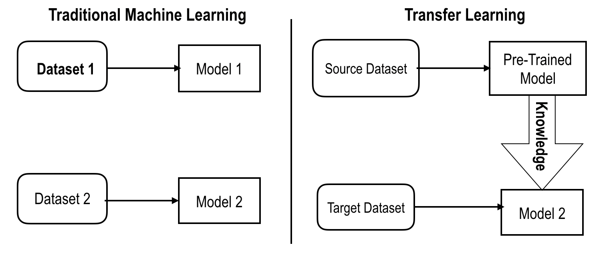
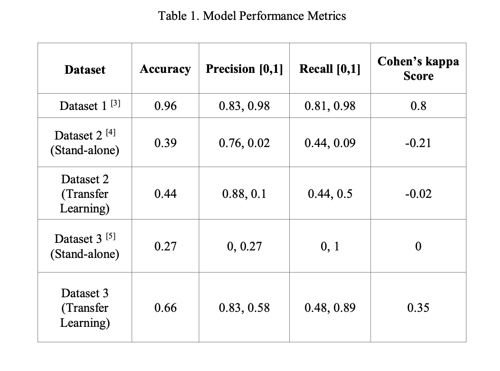

## Project Overview

- Established benchmarks for transfer learning using chemical gas sensor data.
- Utilised pre-trained models for unbalanced data.
- Optimized several deep learning models to improve chemical gas identification.
- Achieved improved performance metrics for binary classification using pre-trained networks.

## Transfer Learning Workflow

## Project Description

An important assumption in machine learning frameworks and algorithms is that the training and test sets must have similar label distributions and that a dataset must have thousands of observations to produce a model that generalizes well. Oftentimes, real-world datasets have dissimilar label distributions and few observations to generate an effective model performance. In such cases, model performance can be improved, if the knowledge acquired through a network trained on a large dataset can be transferred successfully to smaller datasets. This project was an attempt at the proof of concept of transfer learning between gas sensor datasets where the data order is maintained during traning. Initial experimental results indicate significant improvements in model test accuracy and other performance metrics upon applying transfer learning to smaller datasets with label imbalance.

## Dataset Information 

Three chemical gas sensor datasets have been used in this project to build models utilised for transfer learning. A large dataset with millions of observations serves as the source dataset and two, much smaller datasets serve as the target datasets. The aim is to use pre-trained networks as initializations for datasets with fewer observations.

1. [Source Dataset](https://archive.ics.uci.edu/ml/datasets/Gas+sensor+array+temperature+modulation)
2. [Target Dataset 1](https://archive.ics.uci.edu/ml/datasets/gas+sensor+array+under+dynamic+gas+mixtures)
3. [Target Dataset 2](https://archive.ics.uci.edu/ml/datasets/Gas+sensor+array+exposed+to+turbulent+gas+mixtures)

## Project Introduction

Transfer learning can be defined as the process in which the knowledge acquired through the training of one machine learning model can be applied to a similar problem, without having to retrain a new model from scratch. Trnasfer learning can be optimised for target datasets with veru few observations. In this project, datasets related to chemical gas sensors have been utilized to train classifiers using deep neural networks (DNNs) in order to apply transfer learning to smaller but similar datasets. Transfer learning methods using DNNs have been shown to improve a model’s generalization capabilities but have traditionally been applied to perform classification on image and text data and in a few instances, data from motion sensors. This project tackles the challenging task of training classifiers for sensor data for which few benchmark results exist. This is due to a lack of robust pre-trained models for binary classification, unlike pre-trained models such as ResNet and VGG-16 that are available for image classification. 

## Project Workflow

### 1. Model Development

The source dataset is the dataset from which the model weights and features are transferred from and the target dataset is used to train a model using these learned weights. The model architecture for the pre-trained model is a multi-layer perceptron (MLP) and is implemented using Keras. The basic model architecture has an input and output layer with three hidden layers in between. The hidden layer and the number of neurons increase the complexity of the network and help the model generalize better. The activation function used in the output layer is sigmoid and it computes the probability of the label belonging to a certain class.

Since this is a binary classification problem for predicting the presence or absence of CO at a particular time, the sigmoid activation function works well. All datasets are initially utilized to train standalone models and subsequently the target datasets are used to perform transfer learning. Networks trained for transfer learning have different number of layers and neurons. The standalone model for the source dataset is trained for fifty epochs to achieve high accuracy and to ensure that the model converges successfully. Training for fewer epochs might hinder model performance. The optimizer used throughout this project is the Adam optimizer and this is a gradient descent algorithm that optimizes learning rates for all parameters. Similar model architectures have been used on datasets 2 and 3 to establish standalone model performances for datasets with reduced number of observations. These standalone performances will then be compared the performance of the pre-trained model on both the datasets. The hypothesis for this project is that the pre-trained networks obtained from training on large datasets with DNNs can be utilized on much smaller datasets with improved test accuracy and other robust metrics such as precision and recall.

### 2. Results of Training using Pre-Trained Models on the Target Datasets

The table below summarises the results of model training on all three datasets and diplays model training accuracies, precision, recall and Cohen's kappa metrics. Since this is a binary classification problem, the results displayed are for both 0 and 1, i.e, presence and absence of the gas(methane,CO,etc) at a particular instant.

### Conclusions

Comparing the performance of standalone models to models using transfer learning, there is a remarkable improvement in test accuracy, precision and recall, which leads to a conclusion that transfer learning improves model performance for datasets much smaller than the source dataset and datasets that have label imbalance. Transfer learning can indeed be utilized for binary classification tasks, particularly for chemical gas sensors that have varying levels of humidity and temperatures, which further demonstrates its effectiveness. Performance metrics can be improved by utilizing larger target datasets that have equal label distribution. 

Based on the results generated in Table 1, it is evident that the pre-trained network has improved classification accuracies for both the target datasets. The model performances have also been gauged using more robust metrics such as confusion matrix, precision, recall and Cohen’s kappa score since the datasets are imbalanced in label distribution and hence only the test accuracy will not provide an accurate representation the model’s generalization capability. The Cohen’s kappa score is a statistical measure that indicates the extent of agreement between predicted and actual values. The closer the value is to 1, the better the model’s predictions are. The score has improved considerably for Dataset 3, which indicates the model’s improved ability to classify labels in the test set. The target datasets have been resampled to artificially increase the number of minority samples in the training set. While this resampling did not have considerable impact on final model accuracy, it provided an insight into the importance of having balanced datasets. Training standalone models provided interesting insights into model performances for balanced and imbalanced datasets. It can be concluded that transfer learning can be applied sensor data with reasonable accuracy and using the pre-trained network has generated greater test accuracy on Dataset 3 compared to the standalone models. Transfer learning does not provide a considerable improvement in model accuracy for imbalanced datasets, as indicated by the model performance on Dataset 2. 
Future work can be conducted on balanced target datasets and robust benchmarks can be set in the area of transfer learning for binary classification.

